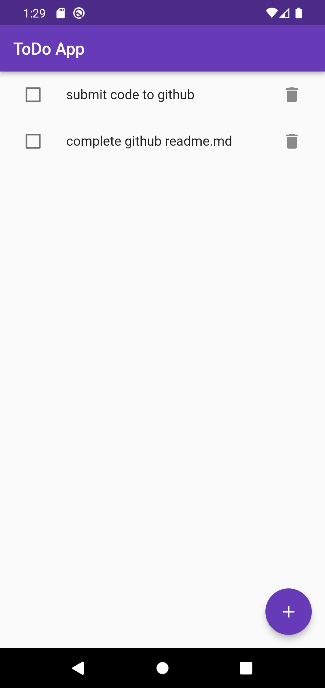
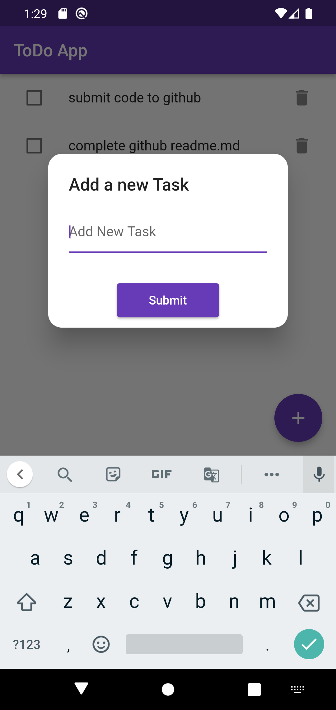

# 📝Simple ToDo App  

A simple todo app to learn provider.
**It only consists of 2 screens.**

Star⭐ the repo if you like what you see😉.

## 📸 ScreenShots

| 1 | 2|
|------|-------|
|||

## ✨ Requirements
* Any Operating System (ie. MacOS X, Linux, Windows)
* Any IDE with Flutter SDK installed (ie. IntelliJ, Android Studio, VSCode etc)
* A little knowledge of Dart and Flutter

## 🤓 Author(s)
**Sourav Sarker Emon**

- [Lab: Write your first Flutter app](https://flutter.io/docs/get-started/codelab)
- [Cookbook: Useful Flutter samples](https://flutter.io/docs/cookbook)

For help getting started with Flutter, view our 
[online documentation](https://flutter.io/docs), which offers tutorials, 
samples, guidance on mobile development, and a full API reference.
